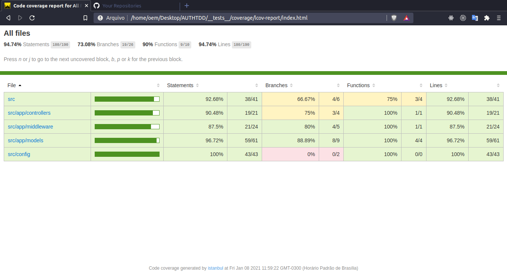
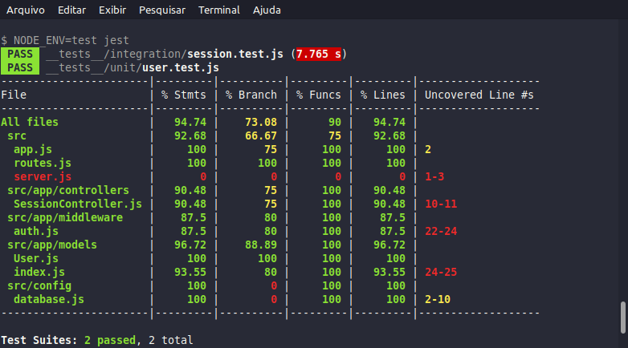

<h1 align="center">
    
</h1>

<h4 align="center">
	:heavy_check_mark: Auth TDD Node.js backend, testes automatizados 🚀 Concluído! :heavy_check_mark:
</h4>
<p align="center">
  
</p>

<p align="center">
  <a href="#information_source-sobre-o-projeto">Sobre o projeto</a>&nbsp;&nbsp;&nbsp;|&nbsp;&nbsp;&nbsp;
  <a href="#computer-objetivo">Objetivo</a>&nbsp;&nbsp;&nbsp;|&nbsp;&nbsp;&nbsp;
  <a href="#rocket-tecnologias">Tecnologias</a>&nbsp;&nbsp;&nbsp;|&nbsp;&nbsp;&nbsp;
  <a href="#information_source-como-instalar">Como instalar</a>&nbsp;&nbsp;&nbsp;|&nbsp;&nbsp;&nbsp;
</p>

## :information_source: Sobre o Projeto

PROJETO desenvolvido para testes de TDD. Aprendizado de desenvolvimento guiado por testes automatizados.

## :computer: Objetivo

O projeto consiste em testar funcionalidades de autenticação para o controller principal.

<h1 align="center">
    
</h1>

## :rocket: Tecnologias

O projeto foi desenvolvido com as seguintes tecnologias e depêndencias:

## :computer: Backend:

- [Node.js][nodejs]
- [Bcrypt.js][bcryptjs]
- [Dotenv][dotenv]
- [Express][express]
- [factory-girl][factory-girl]
- [Faker][faker]
- [Jsonwebtoken][jsonwebtoken]
- [Mysql][mysql]
- [Sequelize][sequelize]

## :computer: Depêndencias de desenvolvimento:

- [Jest][jest]
- [Nodemon][nodemon]
- [Sqlite][sqlite]
- [Supertest][supertest]

## :information_source: Backend

Para testes foi usado um banco de dados sqlite. O banco automaticamente deleta todos registros assim que roda o comando yarn test. Ele limpa todas tabelas e faz um trucate.

O banco de dados para a aplicação para os testes é o sqlite.

## :information_source: Requisitos para rodar

- Yarn: [yarn] e [Node.js: versão utilizada v14.15.0][nodejs]

## :information_source: Como instalar

Clone a aplicação com o git clone, siga os passos abaixo.

Reposiórios individuais:

Em seu terminal na linha de comando:

### Instale o Backend

```bash
# Clone o repositório
$ git clone https://github.com/JulioCesar012/AUTHTDD.git

# Vá para a pasta backend
$ cd AUTHTDD

# Instale as dependências
$ yarn install
      ou
$ npm install

# Inicie o teste com o comando
$ yarn test

Logo após você verá os testes de autenticação se eles ocorreram tudo certo ou se falhou.

# Arquivos de testes
Os arquivos de testes se encontram na pasta __tests__ dentro de integration e unit.

Testei apenas testes de integração e unitários. Fique a vontade para testar outras funções, etc.
```

Desenvolvido com ♥ por @JulioCesar012 :wave: [Me contate!](https://www.linkedin.com/in/julio-cesar-filho-759653171/)

[nodejs]: https://nodejs.org/
[bcryptjs]: https://www.npmjs.com/package/bcryptjs
[dotenv]: https://www.npmjs.com/package/dotenv
[express]: https://expressjs.com/pt-br/
[factory-girl]: https://www.npmjs.com/package/factory-girl
[faker]: https://www.npmjs.com/package/faker
[jsonwebtoken]: https://jwt.io/
[mysql]: https://www.mysql.com/
[sequelize]: https://sequelize.org/
[jest]: https://jestjs.io/
[nodemon]: https://nodemon.io/
[sqlite]: https://www.npmjs.com/package/sqlite3
[supertest]: https://www.npmjs.com/package/supertest
